<div align="center">
  
  <h1>PlumChat</h1>
  <p><strong>Your AI-powered conversational interface for Greenplum Database</strong></p>
  <p>
    
    
    
    
  </p>
</div>

## 🚀 Overview

PlumChat is an intelligent, agentic application that provides a natural language interface to your Greenplum (or PostgreSQL) database. It leverages the power of Large Language Models (LLMs) and a modular, microservices-based architecture to allow you to explore schemas, query data, and manage your database using plain English.

## ✨ Features

*   **Natural Language Querying**: Ask complex questions about your data in plain English. PlumChat translates your questions into SQL, shows you the query for approval, and then executes it.
*   **Schema Exploration**: Discover and explore your database's schemas, tables, and columns conversationally.
*   **Database Management**: Perform administrative tasks like starting and stopping the database (coming soon).
*   **Secure and Modular**: Built with a security-first mindset, PlumChat uses a modular architecture that separates concerns and enhances scalability.
*   **Web-Based UI**: A clean and intuitive chat interface built with React.

## 🏛️ Architecture

PlumChat is built on the **Model-Context-Protocol (MCP)**, a powerful architectural pattern that separates the AI "brain" from the tools and data it uses.

```mermaid
graph TD
    A[🌐 React UI] --> B( plumchat-client);
    B --> C( mcp-schema-server);
    B --> D( mcp-query-server);
    B --> E( mcp-mgmt-server);
    C --> F[(Database)];
    D --> F;
    E --> G([gpstart/gpstop]);

    subgraph PlumChat Host
        B
    end

    subgraph MCP Servers
        C
        D
        E
    end
```



*   **`plumchat-client`**: The central AI agent and orchestrator. It serves the React UI, handles user requests, and communicates with the MCP servers.
*   **`mcp-schema-server`**: A microservice that provides database schema information.
*   **`mcp-query-server`**: A microservice that executes SQL queries against the database.
*   **`mcp-mgmt-server`**: A microservice for administrative tasks (in development).

## 🏁 Getting Started

Follow these steps to get PlumChat up and running on your local machine.

### Prerequisites

*   **Java 21**
*   **Maven 3.8+**
*   **A running Greenplum or PostgreSQL database**
*   **An OpenAI API Key**

### 1. Configure Your Environment

Create a `.env` file in the root of the project by copying the `.env.example` file:

```bash
cp .env.example .env
```

Now, edit the `.env` file with your database credentials and OpenAI API key.

### 2. Build the Project

The provided `start-mcps.sh` script has a `--build` option that will build all the necessary modules.

### 3. Run the Application

You can use the `start-mcps.sh` script to start all the required services.

```bash
./start-mcps.sh start --build
```

This will:
1.  Build all the microservices.
2.  Start the `mcp-schema-server` on port `8080`.
3.  Start the `mcp-query-server` on port `8081`.
4.  Start the `plumchat-client` on port `8090`.

### 4. Access PlumChat

Once all the services are running, you can access the PlumChat UI in your browser at:

**[http://localhost:8090](http://localhost:8090)**

## 💬 Usage Example

You can interact with PlumChat using natural language. For example:

> **User:** show me the first 10 people in the customers table (schema: public)

PlumChat will then generate the appropriate SQL query, show it to you for approval, and then display the results.

## 📂 Project Structure

```
plumchat/
├── mcp-client/         # Generic MCP testing client
├── plumchat-client/    # Main PlumChat Host application
├── mcp-schema-server/  # MCP Server for schema information
├── mcp-query-server/   # MCP Server for query execution
└── mcp-mgmt-server/    # MCP Server for management tasks
```

## 🛠️ Tech Stack

*   **Backend**: Java 21, Spring Boot 3.5.5, Spring AI 1.0.1
*   **Frontend**: React 18
*   **Build**: Maven
*   **Database**: Greenplum / PostgreSQL

## 🙌 Contributing

[Contributing guidelines to be added]

## 📄 License

[License information to be added]